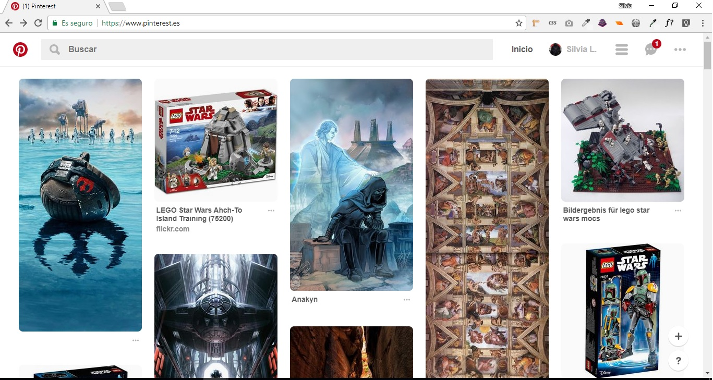
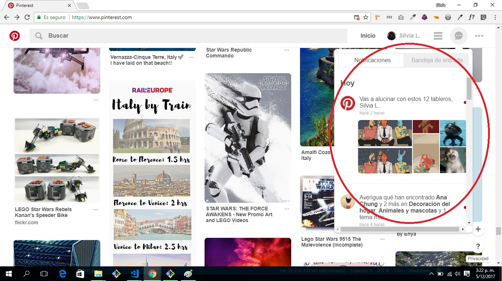
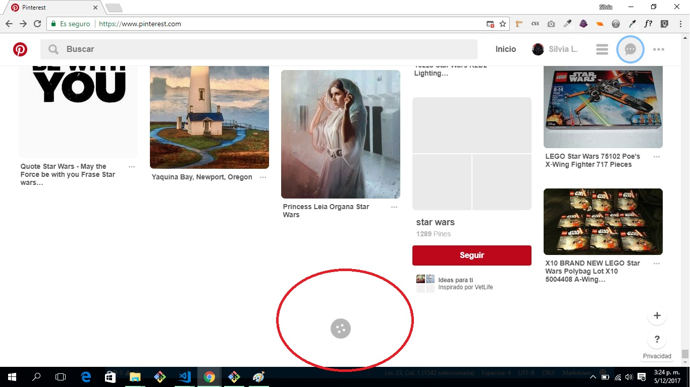
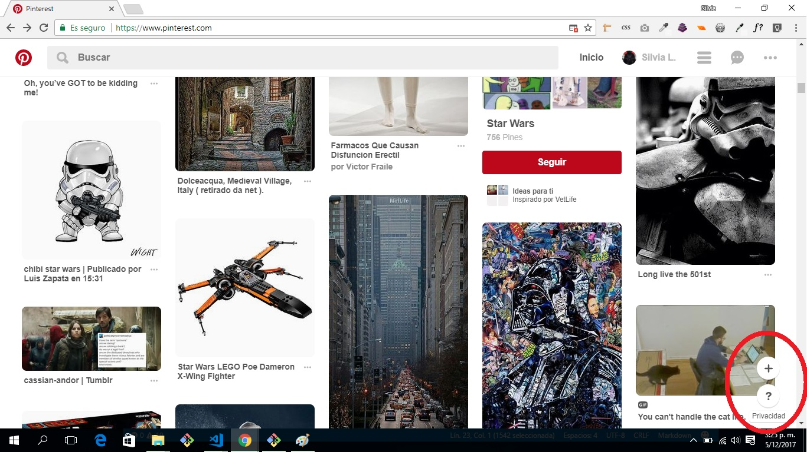
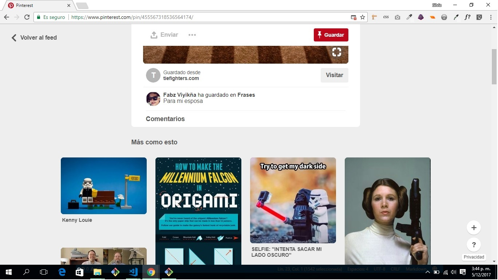

## UX vs UI  de Pinterest 

***
## UX
1. Muestra una barra al inicio donde puedes ingresar tu búsqueda.
2. Al hacer click en la barra de búsqueda, te muestra tus búsquedas recientes.
3. Muestra imágenes que tus contactos han subido, dándolas como recomendadas, para revisarlas.
4. Muestra las notificaciones de actividades recientes de los contactos a los que sigues. 
5. Cuando eliges una imagen a guardar, te muestra imágenes relacionadas al tema, sugiriendote revisarlas, al igual que el album del contacto que las contiene.
6. La muestra de carga de imagenes al descender el scroll se muestra de manera constante.

## UI
1. Barra de navegación con botones para búsqueda, regreso a inicio, vista de tu perfil, categorias, mensajes y configuración.
2. Lado izquierdo se coloca el logo pinterest en rojo.
3. En la barra de búsqueda se puede ingresar texto extenso.
4. En tu icono de perfil te permite subir una imagen/foto como avatar.
5. El orden de la imágenes es de  5 columnas, sin filas definidas.
6. Las imágenes mostradas en las columnas son mayormente rectangulares, no entran imagenes circulares.
7. En el extremo inferior derecho se coloca dos botones circulares con fondo blanco las opción **+ y ?,** para instalación de app y para ayuda.
8. Hay un efecto **hover** de manera general, al pasar el mouse por las diferentes opciones que nos muestra la página.
9. El scroll  muestra funcionalidad de carga imagenes de  constante.

***

